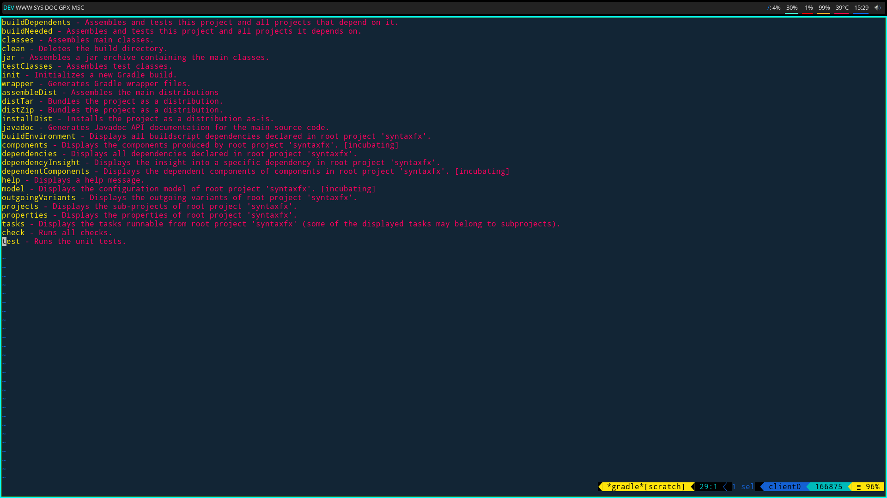

# kak-gradle 

**kak-gradle** is a plugin that integrates the Gradle build system into Kakoune.



## Installation

### plug.kak

Add the following to your `kakrc`:

```
plug "https://codeberg.org/jdugan6240/kak-gradle"
```

### kak-bundle

Add the following to your `kakrc`:

```
bundle https://github.com/jdugan6240/kak-gradle
```

### Manual installation

Clone this repo anywhere, and then add the following lines to your `kakrc`:

```
source /path_to_cloned_repo/rc/kak-gradle.kak
source /path_to_cloned_repo/rc/groovy-gradle.kak # For .gradle file highlighting and indentation
```

## Usage

The first step in using the plugin is to ensure that the gradle daemon is started
(otherwise, the first gradle task run will take a while to execute). The easiest way to
do this is to simply run the command:

```
:gradle
```

Now that the gradle daemon is started, various gradle tasks can be run from within Kakoune.

## Options

kak-gradle offers one configuration option, `gradle_use_gradlew`. This is a boolean option that,
if set to `true`, tells kak-gradle to use the current gradle project's own wrapper. If false, then
the plugin will default to using the systemwide gradle installation.

### Gradle-tasks

One command that deserves attention is the `gradle-tasks` command. Instead of opening a terminal
like most others, this command lists all the tasks available in the current project/subproject
in a scratch buffer. In this buffer, pressing Enter/Return will execute the gradle task on
the current line.

## Commands

- gradle - Executes any arbitrary gradle command in a terminal.
- gradle-init - Initializes a gradle project in the current working directory, if one doesn't exist already.
- gradle-wrapper - Generates the gradle wrapper files. This accepts arguments as the "gradle wrapper" command would.
- gradle-projects - Lists the subprojects of the current gradle project, if any.
- gradle-tasks - Shows the possible tasks that can be performed.
- gradle-dependencies - Shows a tree view of the dependencies in the current gradle project. 


## License

This plugin is "licensed" under the Unlicense.
